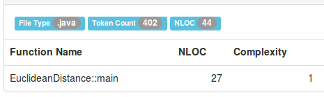
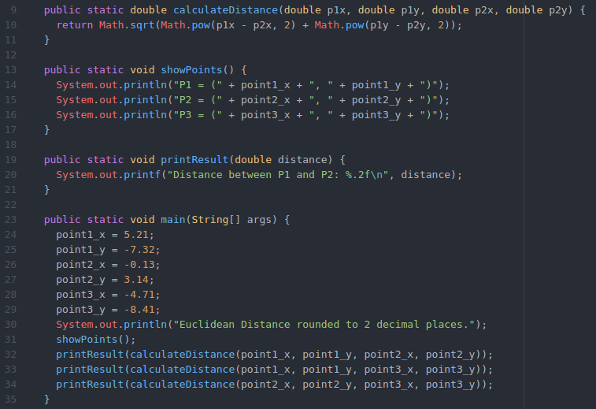

## ZJPROG 2018/2019 - Egzamin

[options="header"]
|=========================================================
| Nazwa Grupy        | Termin Prezentacji
| M.M. & M.P. (Java) | 8.01.2019, godz. 12.15–13.45, a. 2.
|=========================================================

## Plan Działania

**Założenia wstępne**

Kod opisuje punkty na wykresie i coś, co można z nimi zrobić (np. liczyć
odległości między tymi punktami), jednak cały umieszczony jest w jednej
klasie, w nieszczęsnym Main'ie. Punkty zadeklarowane "na sztywno" jako
zmienne globalne. Dużo niepotrzebnych zmiennych.

**Refaktoryzacja**

Refaktoryzacja przebiega według następujących kroków.

**(0) Code to repair:**

Początkowy kod do refaktoryzacji.

**(1) Rename Variable:**

Wszystkie niewiele mówiące nazwy zmiennych zostają zmienione na bardziej
sensowne, po których będzie widać, do czego służą.

image::images/lizard/01.png[]

**(2) Extract Method:**

Podział całego wielkiego zbitego kodu na drobne, powtarzalne segmenty
i wyciągnięcie do osobnych metod - zgodnie z rozsądkiem. Ładne metody
trafiają do Main'a - teraz kod jest nieco bardziej czytelny.

image::images/lizard/02.png[]

**(3) Return Modified Value:**

Niech wszystkie metody, które wpływają w jakiś sposób na dane, zwracają
zmodyfikowaną wartość (return).

image::images/lizard/03.png[]

**(4) Inline Variable:**

Przykładowo, jeśli metoda przed zwróceniem wartości przechowuje
ją w zmiennej, której później do niczego nie używamy – zmienna nie jest nam
potrzebna. Niech metoda od razu zwraca wartość, którą ma zwracać.

**(5) Combine Functions into Class:**

Wyodrębnienie wszystkich "globalnych punktów" jako osobną klasę "Punkt"
zawierającą własny konstruktor i metody (przede wszystkim gettery i settery).

image::images/lizard/05.png[]

**(6) Add Line Class:**

**(7) Open Close:**

**(8) Open Close 2:**

**Podsumowanie**

Podsumować, że kod się poprawił, że jest lepszy, czytelniejszy i inne takie.

**Statystyki**

[options="header"]
|============================================================
| Step                             | Lines  | Methods | Ratio
| (0) Code to repair               | 27     | 1       | 27.00
| (1) Rename Variable              | 27     | 1       | 27.00
| (2) Extract Method               | 33     | 4       |  8.25
| (3) Return Modified Value        | 27     | 4       |  6.75
| (4) Inline Variable              | 24     | 4       |  6.00
| (5) Combine Functions into Class | 37     | 11      |  3.36
| (6) Add Line Class               | 54     | 17      |  3.18
| (7) Open Close                   | 56     | 17      |  3.29
| (8) Open Close 2                 | 55     | 17      |  3.24
|============================================================

**Metryki CKJM**

[options="header"]
|======================================================================================================
| Step                             | File              | WMC | DIT | NOC | CBO | RFC | LCOM | Ca | NPM
| (0) Code to repair               | EuclideanDistance | 2   | 1   | 0   | 0   | 12  | 1    | 0  | 2
| (1) Rename Variable              | EuclideanDistance | 2   | 1   | 0   | 0   | 12  | 1    | 0  | 2
| (2) Extract Method               | EuclideanDistance | 5   | 1   | 0   | 0   | 15  | 2    | 0  | 5
| (3) Return Modified Value        | EuclideanDistance | 5   | 1   | 0   | 0   | 15  | 8    | 0  | 5
| (4) Inline Variable              | EuclideanDistance | 5   | 1   | 0   | 0   | 15  | 8    | 0  | 5
| (5) Combine Functions into Class | Point             | 6   | 1   | 0   | 0   | 7   | 3    | 0  | 6
| (5) Combine Functions into Class | EuclideanDistance | 7   | 1   | 0   | 1   | 20  | 19   | 0  | 6
| (6) Add Line Class               | Point             | 6   | 1   | 0   | 0   | 7   | 3    | 0  | 6
| (6) Add Line Class               | Line              | 6   | 1   | 0   | 1   | 7   | 3    | 0  | 6
| (6) Add Line Class               | EuclideanDistance | 7   | 1   | 0   | 1   | 20  | 19   | 0  | 6
| (7) Open Close                   | Point             | 6   | 1   | 0   | 0   | 7   | 3    | 0  | 6
| (7) Open Close                   | Line              | 8   | 1   | 0   | 1   | 18  | 0    | 0  | 8
| (7) Open Close                   | EuclideanDistance | 5   | 1   | 0   | 2   | 13  | 8    | 0  | 4
| (8) Open Close 2                 | Point             | 6   | 1   | 0   | 0   | 7   | 3    | 0  | 6
| (8) Open Close 2                 | Line              | 10  | 1   | 0   | 1   | 22  | 11   | 0  | 10
| (8) Open Close 2                 | EuclideanDistance | 3   | 1   | 0   | 2   | 8   | 1    | 0  | 2
|======================================================================================================
